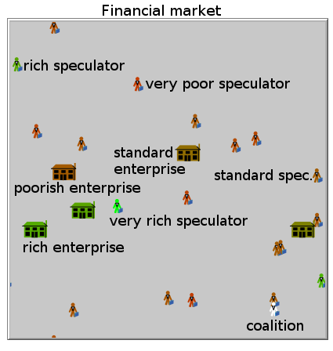
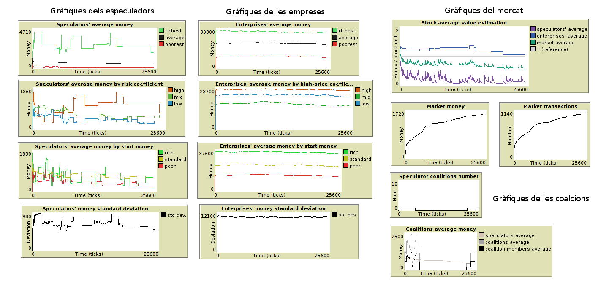

# Stock Market modeled as a Multi-Agent System

Simulation of a stock market as a multi-agent system where different types of agents (speculators and enterprises) can buy and sell stock, and eventually earn or lose fictional money. Agent communication protocols are used to make these and other actions possible, such as the formation and management of agent coalitions. This work was programmed in NetLogo, which is also the name of the IDE that can run it.

| | |
|-|-|
| **Programming language**  | NetLogo |
| **Language**   | English (code variables and functions; UI), Catalan (code comments; documents) |
| **Authors** | Albert Espín and Pau Sanchez |
| **Date**  | December 2017  |
| **Code license**  | MIT |
| **Report license**  | Creative Commons Attribution, Non-Commercial, Non-Derivative |

## Image Gallery

